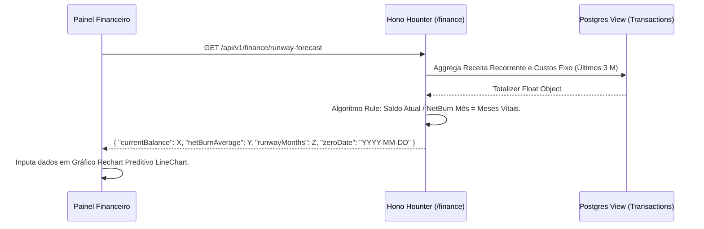

# SDD 001: Runway Calculator (Calculadora de Sobrevivência Módulo Financeiro)

## 1. Resumo Executivo

O Runaway Calculator entrega ao CxO a visibilidade preditiva de quando o caixa da startup esgotará (Zero Date). Baseado num Snapshot mensal entre Disponibilidades Físicas e o Queima de Caixa Média (Burn Rate).

## 2. Architecture Context

- **Frontend (`apps/web/src/modules/finance`)**: Hook interativo onde o CxO pode imputar valores customizados num simulador (aumentando receita ou queima) sobpondo-se ao valor puxado da Database real. Visualização de gráficos via Recharts.
- **Backend API (`apps/api/src/routes/finance`)**: Rota `GET /finance/runway` computa no ato consultando view transacional agregada.
- **Database (Supabase Postgres)**: Tabela base `transactions` filtradas pelas datas para se montar a derivada `burn_rate` em view analítica da Data warehouse local.

## 3. Diagrama Funcional

## 4. Componentes e Rotas Modificadas

| Componente                                 | Finalidade                          | Responsabilidade                   |
| ------------------------------------------ | ----------------------------------- | ---------------------------------- |
| `finance/controllers/runway.ts`            | Computar média dos 90D              | Processamento + Validação de Input |
| `shared/components/PredictiveChart`        | Traçar curva da Morte               | UI pura, responsiva Tailwind       |
| `supabase/migrations/[...]runway_view.sql` | View performática do RLS Financeiro | Database Query Aggregator          |

## 5. Regras a Testar

- Testar quando Net Burn for `0` ou `Negativo` (Receitando mais que perdendo). O runway será categorizado com valor "INFinito" ou limite de teto 10 Anos.
- Validar se transações soltas desconfiguram os cálculos pesados de Recorrência.
