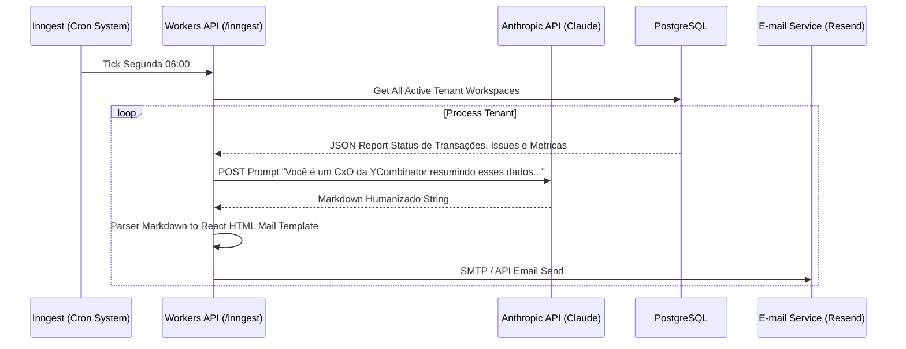

# SDD 002: AI Weekly Digest Automation

## 1. Resumo Executivo

Todas as Segundas-feiras às 06h00 (BRT), os Líderes (Tenants) recebem um e-mail longo auto-analisado pelas LLMs referenciando gastos abruptos, OKRs atrasados e Pull Requests engavetados do sistema Github que podem gerar risco ao Roadmap.

## 2. Architecture Context

- O gatilho de execução é totalmente desacoplado da interação humana do Front-end.
- A orquestração depende do Cron Support da Vercel integrando o Serverless Trigger via CRON, ou um Scheduler cron nativo do Inngest `cron: '0 9 * * 1'`.
- O pacote `@leadgers/ai` empacotará Prompts dinâmicos preenchidos com o JSON Context e contata a Anthropic (Claude).
- Integração transacional com provedor de e-mail (Resend) para layouting transacional.

## 3. Diagrama Funcional

## 4. Componentes e Rotas Modificadas

| Componente                          | Finalidade                         | Responsabilidade                                |
| ----------------------------------- | ---------------------------------- | ----------------------------------------------- |
| `packages/ai/src/prompts/digest.ts` | Guarda instruções de personalidade | Engajamento, Assertividade de Tom (Executive).  |
| `api/src/inngest/weekly-digest.ts`  | Job Runner                         | Try-Catch massivo de chamadas de LLM            |
| `api/src/mail/templates/digest.tsx` | Componente React Email Server-Side | Estruturação HTML para E-mails Client Limitados |

## 5. Cuidados Adicionais e Riscos

- **Rate Limit da Anthropic:** Em caso de o banco estourar para 500 Tenants, processar as 500 requisições LLMs estourarão os Tiers comuns de Rate Limit da Anthropic. É necessário implementar "Concuerncy Limits" e "sleeps" na Function Step native do Inngest limitadores para 10 threads na pipeline.
- **Rompimento RLS Background:** Lembrete que o background process não possui JWT do client vivo. Devemos instanciar o Database com `ServiceRole` passando manualmente a verificação e filtrando o Request do DB localmente por cada Tenant no loop interativo de busca.
